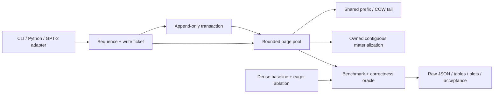
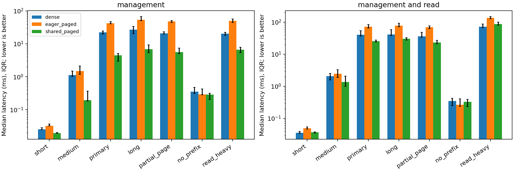

# BranchSafe KV

[Public repository](https://github.com/hardwork-xu/branchsafe-kv) · [CI](https://github.com/hardwork-xu/branchsafe-kv/actions/runs/36257914534)

**Bounded transactional KV storage for branching inference research.**

[简体中文](README_zh.md) · [Research](docs/en/RESEARCH.md) · [Code walkthrough](docs/en/WALKTHROUGH.md)

 

I maintain BranchSafe KV to make cache ownership, rollback and memory costs inspectable on a modest machine. Reusing a long attention prefix is useful for speculative branches and alternative continuations; copying the entire prefix on every fork can dominate cache management. Sharing it introduces ownership and failure paths that deserve explicit contracts.

The concrete weekly trigger is [vLLM PR #56734](https://github.com/vllm-project/vllm/pull/56734), merged **2026-09-21**, about stale block-table writes during dummy speculative decoding. This is a topical systems problem, not a claim that this repository reproduces or fixes that CUDA bug. The source audit covers the week **September 21–27, 2026**; it establishes active engineering work, not a popularity ranking.

## What is implemented

- A NumPy page pool with prefix sharing, partial-tail copy-on-write, retained-slot reuse, explicit close and payload/sequence-count limits.
- Append-only transactions with partial acceptance, automatic rollback and parent-version conflict detection; checked write tickets prevent stale or cross-sequence writes through the public API.
- Allocation and copying failure cleanup, exact K/V ownership, no writable views into cache storage, and serialized thread-safe operations.
- A practical preallocated dense-copy baseline, eager-paged ablation, real timing/RSS measurements and optional pinned GPT-2 validation.
- Bilingual CLI, programmatic API and NPZ workflow. No commercial key is needed.

**Audience:** inference-system students and engineers studying branch-cache lifecycles. **Not included:** a serving engine, CUDA/Metal kernel, model trainer, multi-process shared cache, cache eviction policy or production security boundary. This implementation is CPU-only even on a machine with Metal hardware.

The contribution is an independently implemented, auditable lifecycle and evaluation package. Paging, reference counting, COW and versioned identity are established ideas; see [attribution and novelty boundary](docs/en/RESEARCH.md) and [NOTICE](NOTICE.md). NumPy provides array allocation/copying; this project implements ownership, page tables, reservation, transactions, validation and evidence collection.

## Architecture and algorithm



For prefix length `T`, page size `P`, and bytes per KV token `b = 2 × layers × heads × head_dim × itemsize`, eager fork copies `T × b` bytes. Shared fork updates `ceil(T/P)` page references. Append copies new tokens and, when necessary, the shared partial tail. It also copies the Python page table: this is not constant-time metadata. Materialization copies all logical K/V bytes. The invariant is: **a shared page is never modified in place, and refcounts equal live ownership references**.

Transactions preserve the original prefix and publish only an accepted appended prefix if the parent ticket still matches. Invalid input or an exhausted configured budget leaves visible state unchanged. Exact behavior and the bounded failure model are in [Architecture](docs/en/ARCHITECTURE.md).

## Install and quick start

Supported language range: Python 3.11–3.13; the original local run used Python 3.12.2 on macOS arm64. Linux CI passed on Python 3.11, 3.12 and 3.13; the container build/demo also passed on a GitHub-hosted Ubuntu runner. Use a project-local tool environment:

```bash
python3 -m venv .venv-tools
.venv-tools/bin/python -m pip install uv==0.8.22
.venv-tools/bin/uv sync --frozen
export PATH="$PWD/.venv-tools/bin:$PWD/.venv/bin:$PATH"
.venv/bin/branchsafe demo
.venv/bin/python examples/branch.py
```

The offline example creates a 17-token parent, forks a child, appends 5 tokens, commits 3 and rolls another transaction back. It checks exact arrays and zero live bytes after cleanup; these are synthetic K/V, not generated model text.

```python
import numpy as np
from branchsafe import CacheConfig, PagedCache

with PagedCache(CacheConfig(layers=1, heads=2, head_dim=8, max_pages=32)) as pool:
    parent = pool.create()
    x = np.ones((1, 17, 2, 8), dtype=np.float32)
    parent.append(x, x)
    with parent.transaction() as branch:
        branch.append(x[:, :4], x[:, :4])
        branch.commit(accepted_tokens=2)
    k, v = parent.materialize()  # independent copies; shape (1,19,2,8)
    pool.check_invariants()
```

For real external arrays: `branchsafe branch --input input.npz --output accepted.npz --accept 8`. The NPZ must contain `prefix_k`, `prefix_v`, `suffix_k`, `suffix_v`, each float32 `[layers,tokens,heads,dim]`. [Walkthrough](docs/en/WALKTHROUGH.md) explains the API, errors and layout.

## Reproduction

```bash
.venv/bin/pytest
.venv/bin/ruff check .
.venv/bin/ruff format --check .
.venv/bin/mypy
.venv/bin/python benchmark.py --output results/benchmark.json
.venv/bin/python scripts/analyze.py
.venv/bin/python scripts/update_readme.py
.venv/bin/python -m build
.venv/bin/python scripts/validate.py
```

`make` exposes the same operations (`UV=.venv-tools/bin/uv`). `uv.lock` pins transitive dependencies and archive hashes. Default tests are offline. Optional pretrained validation downloads about 550 MB of public model artifacts and runs only on CPU:

```bash
.venv-tools/bin/uv sync --frozen --group model
.venv/bin/python scripts/validate_model.py --output results/model.json
```

**The model command currently exits 1 intentionally because the stricter full-recomputation diagnostic fails its fixed threshold.** Native cache equivalence passes. This known failure remains in the raw report; it is not a skipped test or a success hidden behind a warning.

```bash
docker build -t branchsafe-kv:0.1.0 .
docker run --rm branchsafe-kv:0.1.0
```

Docker was unavailable locally; see [release status](docs/en/RELEASE.md) for any separately verified GitHub-hosted container run.

## Benchmark results

Apple M1 Pro, 16 GiB unified memory, CPU NumPy float32; one numerical thread, 3 warmups and 21 measured repetitions per method/case/scope, randomized method order. All seven workloads use 4 layers × 4 KV heads × 64 dimensions. The primary case has a 2048-token prefix, 8 simultaneous branches, 16 appended and 8 accepted tokens, page size 16. This is a cache subsystem experiment, **not end-to-end model inference**.

Preload is measured separately. Management includes fork, append validation/copying, truncation, child/parent cleanup and pool destruction. Read scope adds an owned contiguous materialization of every branch; the read-heavy case repeats reads four times. Peak payload and copying counters include the initial parent, while management latency excludes preload. Managed live payload, retained arrays and fresh-process peak RSS are separate metrics. Complete median/IQR, preload, copy and RSS data: [summary](results/summary.json), [raw measurements](results/benchmark.json), [protocol](docs/en/EXPERIMENTS.md).

<!-- benchmark:begin -->
# Measured cache operations

| Case | Dense ms | Eager paged ms | Shared paged ms | Speedup | Payload ratio |
|---|---:|---:|---:|---:|---:|
| short | 0.025 | 0.032 | 0.019 | 1.30x | 50.0% |
| medium | 1.120 | 1.492 | 0.194 | 5.77x | 23.5% |
| primary | 22.587 | 42.500 | 4.502 | 5.02x | 11.7% |
| long | 26.974 | 53.883 | 6.866 | 3.93x | 20.2% |
| partial_page | 20.668 | 48.522 | 5.656 | 3.65x | 12.4% |
| no_prefix | 0.350 | 0.291 | 0.288 | 1.21x | 88.9% |
| read_heavy | 20.551 | 50.011 | 6.666 | 3.08x | 11.7% |

## Management + materialization

| Case | Dense ms | Eager paged ms | Shared paged ms | Speedup | Payload ratio |
|---|---:|---:|---:|---:|---:|
| short | 0.036 | 0.049 | 0.037 | 0.97x | 50.0% |
| medium | 2.060 | 2.473 | 1.346 | 1.53x | 23.5% |
| primary | 40.748 | 71.401 | 25.481 | 1.60x | 11.7% |
| long | 41.452 | 77.955 | 30.450 | 1.36x | 20.2% |
| partial_page | 35.967 | 68.727 | 23.014 | 1.56x | 12.4% |
| no_prefix | 0.346 | 0.266 | 0.327 | 1.06x | 88.9% |
| read_heavy | 72.620 | 136.611 | 87.468 | 0.83x | 11.7% |
<!-- benchmark:end -->

Targets were committed in [the preregistered plan](docs/en/PLAN.md) before implementation: primary management speedup **≥2.0×**; managed live KV payload **≤30%** of dense; exact K/V equality; pretrained logit error **≤1e-5** with matching greedy IDs. The generated measured table is distinct from these targets. [Experiments](docs/en/EXPERIMENTS.md) records the exact pass/fail comparison, unfavorable cases and full-recompute failure.



## Limits and verification scope

Materialization is expensive; a long read-heavy workload can lose the management benefit. Python page-table/refcount work can dominate small payloads. No GPU, production traffic, tokenizer scheduler or speculative acceptance-rate claim is made. A global lock ensures consistent operations but does not provide parallel compute scaling. Inputs must not be mutated concurrently during an operation. Free pages may retain bytes until pool close; this is not secure erasure or tenant isolation.

The original host was shared with other processes: timing is descriptive, order-randomized evidence, not a controlled hardware-isolation study. Twenty-one samples do not justify p99 claims. Full recomputation and cached float32 inference can use different matrix shapes; GPT-2 native/paged paths were identical while the stronger full-recompute gate failed. [Acceptance evidence](results/acceptance/checks.json) distinguishes passed, failed and not-run checks.

## Documentation and release

| Read | Purpose |
|---|---|
| [Research](docs/en/RESEARCH.md) | Question, sources, proof obligations, complexity, novelty limits |
| [Architecture](docs/en/ARCHITECTURE.md) | Interfaces, lifetimes, failures and tradeoffs |
| [Experiments](docs/en/EXPERIMENTS.md) | Full protocol, results and adverse cases |
| [Development](docs/en/DEVELOPMENT.md) | Actual changes, failures and real commits |
| [Walkthrough](docs/en/WALKTHROUGH.md) | Entry-to-core reading and debugging guide |
| [Release](docs/en/RELEASE.md) | Build, draft notes, public release status |
| [Resume and discussion](docs/en/RESUME.md) | Evidence-linked project descriptions and interview explanation |

[Contributing](CONTRIBUTING.md) · [Security and limits](SECURITY.md) · [Third-party notices](NOTICE.md) · [MIT license](LICENSE). Cite the software version using [CITATION.cff](CITATION.cff); there is no claimed paper, DOI or publication acceptance. Package artifacts are built locally; public repository and CI status are recorded separately from package publication.
