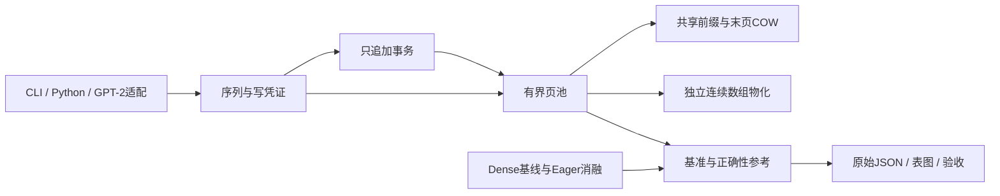

# BranchSafe KV

[公开仓库](https://github.com/hardwork-xu/branchsafe-kv) · [CI](https://github.com/hardwork-xu/branchsafe-kv/actions/runs/36257914534)

**面向分支推理研究的有界事务式 KV 存储。**

[English](README.md) · [研究说明](docs/zh/RESEARCH.md) · [代码导读](docs/zh/WALKTHROUGH.md)

 

我维护这个项目，是为了在普通机器上把缓存所有权、回滚和内存成本变成可检查的行为。投机分支和候选续写可以复用较长的 attention 前缀，但每次 fork 都复制完整前缀可能占据大量缓存管理时间；共享又引入需要明确约束的所有权与失败路径。

本周的具体切入点是 **2026-09-21** 合并的 [vLLM PR #56734](https://github.com/vllm-project/vllm/pull/56734)：dummy speculative decoding 通过过期块表写坏缓存。本项目不声称复现或修复该 CUDA 故障。资料窗口为 **2026年9月21–27日**；来源证明本周有相关工程活动，不证明话题热度排名。

## 实际功能

- NumPy 页池：共享前缀、末页写时复制、空闲槽复用、显式释放、数据字节与序列数量上限。
- 只追加事务：部分接受、自动回滚、父版本冲突检测；写凭证在公开 API 中拒绝过期和跨序列写入。
- 分配与复制失败清理、精确 K/V 所有权、不暴露内部可写视图，以及串行加锁的线程安全操作。
- 预分配 dense-copy 实用基线、eager-paged 消融、真实计时与 RSS 测量、固定版本 GPT-2 验证。
- 双语 CLI、Python API 与 NPZ 工作流，不需要商业密钥。

**面向用户：** 研究分支缓存生命周期的推理系统学生和工程师。**不包含：** 完整服务引擎、CUDA/Metal 算子、模型训练、多进程共享缓存、淘汰策略或生产安全隔离。本版本只在 CPU 执行，即使机器具备 Metal 硬件。

贡献是独立实现且可审计的生命周期机制与评测包。分页、引用计数、COW 和版本化身份都是已有思想；参见[原创性边界](docs/zh/RESEARCH.md)与[第三方说明](NOTICE_zh.md)。NumPy 提供数组分配与复制，本项目实现所有权、页表、资源预留、事务、校验和证据收集。

## 架构与算法



前缀长度为 `T`、页大小为 `P`、每个 KV token 字节数为 `b = 2 × layers × heads × head_dim × itemsize` 时，完整复制 fork 需复制 `T × b` 字节，共享 fork 更新 `ceil(T/P)` 个页引用。追加复制新增 token，必要时复制共享末页；还要复制 Python 页表，因此元数据处理不是常数时间。物化复制全部逻辑 K/V。核心不变量是：**共享页不原地修改，引用计数等于存活所有权引用数**。

事务保留原前缀，仅在父写凭证仍一致时发布接受的新增前缀。非法输入或超过配置预算不会改变可见状态。具体行为及失败模型见[架构](docs/zh/ARCHITECTURE.md)。

## 安装与快速开始

语言范围为 Python 3.11–3.13；原始本机验证为 macOS arm64、Python 3.12.2。Linux CI 已通过 Python 3.11、3.12、3.13，GitHub 托管 Ubuntu 容器构建与 demo 也已通过。工具环境也保留在项目内：

```bash
python3 -m venv .venv-tools
.venv-tools/bin/python -m pip install uv==0.8.22
.venv-tools/bin/uv sync --frozen
export PATH="$PWD/.venv-tools/bin:$PWD/.venv/bin:$PATH"
.venv/bin/branchsafe demo
.venv/bin/python examples/branch.py
```

离线示例建立17-token父序列、fork子序列、追加5个token并接受3个，另一个事务回滚。示例检查数组逐位相同及清理后存活字节为零；这些是合成 K/V，不是模型生成文本。

```python
import numpy as np
from branchsafe import CacheConfig, PagedCache

with PagedCache(CacheConfig(layers=1, heads=2, head_dim=8, max_pages=32)) as pool:
    parent = pool.create()
    x = np.ones((1, 17, 2, 8), dtype=np.float32)
    parent.append(x, x)
    with parent.transaction() as branch:
        branch.append(x[:, :4], x[:, :4])
        branch.commit(accepted_tokens=2)
    k, v = parent.materialize()  # 独立副本，形状 (1,19,2,8)
    pool.check_invariants()
```

外部实际数组使用：`branchsafe branch --input input.npz --output accepted.npz --accept 8`。NPZ 包含 `prefix_k`、`prefix_v`、`suffix_k`、`suffix_v`，均为 float32 `[layers,tokens,heads,dim]`。[代码导读](docs/zh/WALKTHROUGH.md)说明 API、错误及布局。

## 复现

```bash
.venv/bin/pytest
.venv/bin/ruff check .
.venv/bin/ruff format --check .
.venv/bin/mypy
.venv/bin/python benchmark.py --output results/benchmark.json
.venv/bin/python scripts/analyze.py
.venv/bin/python scripts/update_readme.py
.venv/bin/python -m build
.venv/bin/python scripts/validate.py
```

`make` 提供同样操作（指定 `UV=.venv-tools/bin/uv`）。`uv.lock` 固定传递依赖和归档哈希。默认测试离线；可选预训练验证下载约550 MB公开模型文件，使用 CPU：

```bash
.venv-tools/bin/uv sync --frozen --group model
.venv/bin/python scripts/validate_model.py --output results/model.json
```

**模型命令当前明确返回退出码1，因为更严格的完整重计算诊断未通过固定阈值。** 原生缓存等价验证通过。已知失败保留在原始报告中，既不作为skip，也不隐藏为成功警告。

```bash
docker build -t branchsafe-kv:0.1.0 .
docker run --rm branchsafe-kv:0.1.0
```

本机没有 Docker；若之后单独验证 GitHub 托管容器运行，状态见[发布文档](docs/zh/RELEASE.md)。

## 基准结果

Apple M1 Pro、16 GiB统一内存、CPU NumPy float32；数值线程为1，预热3次，每个方法/场景/计时范围测21次，方法顺序随机交错。7个工作负载均为4层×4个KV头×64维。主要场景前缀2048、8个同时存活分支、追加16、接受8、页大小16。这是缓存子系统实验，**不是模型端到端推理实验**。

预载单列计时。管理计时包含fork、追加校验与复制、截断、子/父序列清理和页池销毁；读取范围增加每个分支的独立连续物化，read-heavy重复4次。峰值数据与复制计数含父序列预载，管理耗时不含预载。存活数组容量、保留数组与新进程峰值RSS分别统计。完整中位数/IQR、预载、复制和RSS：[统计JSON](results/summary.json)、[原始结果](results/benchmark.json)、[实验协议](docs/zh/EXPERIMENTS.md)。

<!-- benchmark:begin -->
# 缓存操作实测

| 场景 | Dense 毫秒 | Eager paged 毫秒 | Shared paged 毫秒 | 加速比 | 数据字节比例 |
|---|---:|---:|---:|---:|---:|
| short | 0.025 | 0.032 | 0.019 | 1.30x | 50.0% |
| medium | 1.120 | 1.492 | 0.194 | 5.77x | 23.5% |
| primary | 22.587 | 42.500 | 4.502 | 5.02x | 11.7% |
| long | 26.974 | 53.883 | 6.866 | 3.93x | 20.2% |
| partial_page | 20.668 | 48.522 | 5.656 | 3.65x | 12.4% |
| no_prefix | 0.350 | 0.291 | 0.288 | 1.21x | 88.9% |
| read_heavy | 20.551 | 50.011 | 6.666 | 3.08x | 11.7% |

## 管理加连续读取

| 场景 | Dense 毫秒 | Eager paged 毫秒 | Shared paged 毫秒 | 加速比 | 数据字节比例 |
|---|---:|---:|---:|---:|---:|
| short | 0.036 | 0.049 | 0.037 | 0.97x | 50.0% |
| medium | 2.060 | 2.473 | 1.346 | 1.53x | 23.5% |
| primary | 40.748 | 71.401 | 25.481 | 1.60x | 11.7% |
| long | 41.452 | 77.955 | 30.450 | 1.36x | 20.2% |
| partial_page | 35.967 | 68.727 | 23.014 | 1.56x | 12.4% |
| no_prefix | 0.346 | 0.266 | 0.327 | 1.06x | 88.9% |
| read_heavy | 72.620 | 136.611 | 87.468 | 0.83x | 11.7% |
<!-- benchmark:end -->

实现前已提交[固定计划](docs/zh/PLAN.md)：主要管理场景加速 **≥2.0倍**，存活KV数据 **≤Dense的30%**，K/V逐位相同，预训练logits误差 **≤1e-5** 且贪心ID一致。生成的实测表与目标分开。[实验文档](docs/zh/EXPERIMENTS.md)记录精确达标情况、不利场景及完整重计算失败。


图中 management 为管理耗时，management and read 为管理加物化；纵轴为中位毫秒，对数刻度，越低越好。

## 限制与验证范围

物化成本较高，长前缀频繁读取可能抵消管理收益；小数据上 Python 页表与引用计数开销可能占主导。未验证 GPU、生产流量、tokenizer调度或投机接受率。全局锁确保操作一致性，不提供并行计算扩展。调用期间输入数组不得被其他线程修改。空闲页可保留旧字节直到页池关闭，不提供安全擦除或租户隔离。

原始主机还有其他进程，计时是随机交错的描述性证据，不是硬件隔离实验。21个样本不支持p99结论。float32完整重计算与缓存推理使用不同矩阵形状；GPT-2原生与本项目路径完全一致，但更严格的完整重计算门槛失败。[验收记录](results/acceptance/checks.json)区分通过、失败和未执行。

## 文档与发布

| 文档 | 内容 |
|---|---|
| [研究](docs/zh/RESEARCH.md) | 问题、来源、证明条件、复杂度与原创性边界 |
| [架构](docs/zh/ARCHITECTURE.md) | 接口、生命周期、失败与取舍 |
| [实验](docs/zh/EXPERIMENTS.md) | 完整协议、结果与不利场景 |
| [开发记录](docs/zh/DEVELOPMENT.md) | 实际修改、问题与真实提交 |
| [代码导读](docs/zh/WALKTHROUGH.md) | 从入口到核心以及调试方法 |
| [发布](docs/zh/RELEASE.md) | 构建、发布说明草稿与公开状态 |
| [简历与讲解](docs/zh/RESUME.md) | 带证据的项目描述与面试讲解 |

[贡献指南](CONTRIBUTING_zh.md) · [安全与限制](SECURITY_zh.md) · [第三方来源](NOTICE_zh.md) · [MIT许可证](LICENSE)。用 [CITATION.cff](CITATION.cff) 引用软件版本；不声称有论文、DOI或录用。构建产物在本地生成，公开仓库与CI状态和包发布状态分别记录。
