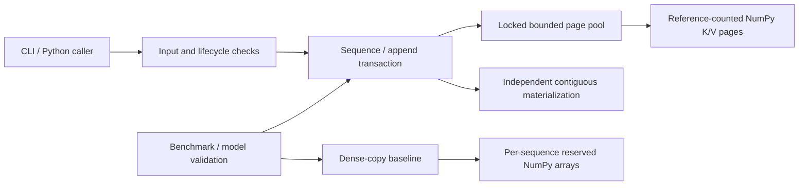

# Architecture and API

[简体中文](../zh/ARCHITECTURE.md) · [Research](RESEARCH.md) · [Walkthrough](WALKTHROUGH.md)

## Module boundaries

| File | Responsibility |
|---|---|
| [core.py](../../src/branchsafe/core.py) | Configuration, input validation, page ownership, write tickets, transactions and invariants |
| [baseline.py](../../src/branchsafe/baseline.py) | Equal-contract dense-copy baseline with the same payload budget |
| [cli.py](../../src/branchsafe/cli.py) | Offline demo; four-array NPZ input and accepted-suffix output |
| [provenance.py](../../src/branchsafe/provenance.py) | Source fingerprint and public-safe environment evidence |
| [benchmark.py](../../benchmark.py) | Repeated storage workloads and machine-readable measurement records |
| [validate_model.py](../../scripts/validate_model.py) | Optional pretrained-model adapter validation |
| [analyze.py](../../scripts/analyze.py) | Tables and plots derived from raw results |

The core depends on NumPy, not a model runtime. It stores tensors supplied by callers; it does not compute queries, attention, logits or draft acceptance decisions. Callers retain responsibility for model identity, positions, attention masks, and whether a cached prefix actually belongs to their request.

## Configuration and ownership

`CacheConfig(layers, heads, head_dim, page_size=16, max_pages=4096, dtype="float32", max_sequences=4096)` requires positive integer dimensions and limits. Booleans are rejected as dimensions. Dtype is one of `float16`, `float32`, `float64`; the exact configured dtype is required on input. K and V must be matching finite NumPy arrays `[layers,tokens,heads,head_dim]`. Noncontiguous arrays are accepted and copied. Zero-token writes are valid no-ops.

`PagedCache(config, sharing=True)` creates a lazy payload pool. `sharing=False` uses the same page manager but copies visible prefix bytes on fork. `DenseCache(config, max_tokens)` reserves one contiguous K/V buffer pair per live sequence; appends copy only new tokens, with no full-prefix concatenation. The dense budget is also `max_pages * page_bytes`.

Create sequences only with `cache.create()` or `sequence.fork()`. The pool owns their lifetime; close resources explicitly or use a cache context. Materialized arrays are independent copies, so callers can mutate them safely. Private attributes are implementation details; Python does not provide a security boundary against hostile introspection.

## Public operations

| Operation | Return / effect | Important failure condition |
|---|---|---|
| `cache.create()` | Empty owned sequence | Payload or sequence budget exhausted |
| `sequence.length` | Visible token count | Closed sequence/cache |
| `sequence.append(k,v,ticket=None)` | Copy new KV into sequence | Invalid input, stale/foreign ticket, insufficient capacity |
| `sequence.fork()` | Independent logical branch | Budget cannot fit another sequence or eager copy |
| `sequence.truncate(n)` | Keep first `n` tokens | `n` outside `[0,length]` or noninteger |
| `sequence.materialize()` | Independent contiguous `(k,v)` arrays | Closed sequence/cache; host allocation can fail |
| `sequence.ticket()` | Immutable `WriteTicket(sequence_id,epoch,length)` | Closed sequence/cache |
| `sequence.transaction()` | Isolated append transaction, forked immediately | Fork admission failure |
| `tx.append(k,v)` | Append only to transaction child | Same input/budget checks |
| `tx.commit(accepted_tokens=None)` | Parent adopts accepted new prefix | Parent changed/closed, invalid acceptance, ended transaction |
| `tx.rollback()` / `tx.close()` | Discard child; idempotent | No error for repeated cleanup |
| `sequence.close()` / `cache.close()` | Release ownership; idempotent | Other reads/writes afterward fail |
| `cache.stats()` | Capacity/copy counters | Counters remain readable after close |
| `cache.check_invariants()` | Assert internal consistency | Raises assertion on an implementation bug |

`accepted_tokens` counts **new tokens relative to transaction creation**, not total sequence length. `None` accepts all appended tokens, `0` accepts none. A successful commit invalidates earlier tickets even when it accepts zero tokens. Invalid acceptance counts can be corrected before context exit. An uncommitted context exit, including an application exception, rolls back. A transaction cannot be reentered, appended to or committed after completion. Explicit transactions outside a `with` block must be closed by the caller.

## Failure and concurrency contract

- `ValueError`: invalid geometry, dtype, values, length or acceptance count. `TypeError`: invalid API object/ticket types.
- `CapacityError`: configured payload or sequence budget rejects admission. `StaleWriteError`: optimistic append/commit sees a different owner or revision. `ClosedError`: resource lifetime has ended. All three inherit `CacheError`.
- A pool-wide `RLock` covers validation and publication. Concurrent operations are serialized; a common ticket can authorize at most one successful nonempty append. This is correctness-oriented locking, not a parallel throughput claim.
- Capacity rejection is checked before allocation/publication. Recoverable allocation/copy failure tests verify unchanged visible data and no leaked live ownership. Retained free pages or historical peaks can differ after failed work. Arbitrary interpreter allocation failure during metadata publication and asynchronous interruption are outside the atomicity guarantee.
- Caller-owned inputs must not be modified concurrently during an append. No writable storage view is returned. There is no cross-process or asynchronous device execution support.

## Resource accounting

`live_bytes` and `peak_bytes` count managed array capacity; `allocated_bytes` additionally includes free reusable pages retained by the paged pool. `close()` releases retained arrays. Python's allocator may retain process memory afterward, so a released payload is not proof of a falling RSS.

`copied_bytes` counts successful append payload, eager-prefix copying, and valid COW tail copying. It excludes input validation reads, page-table metadata, and `materialize()` output copies. The benchmark separately times workflows with materialization, preventing that consumer cost from disappearing from the comparison. Dense `live_pages`/`peak_pages` are rounded page-equivalent capacities, not physical pages.

The sequence count is capped; page-table metadata is still separate from payload accounting. Input arrays, model weights, contiguous output arrays, NumPy/Python overhead and process RSS remain outside the pool budget. The CLI additionally caps uncompressed NPZ payload at 256 MiB and the requested pool payload at 2 GiB, disables pickled arrays, and rejects identical input/output paths.

## Deliberate tradeoffs

The eager-paged variant isolates the benefit of sharing from the overhead of page management. The dense baseline favors contiguous readers and short branches. Returning copied contiguous arrays gives a simple ownership contract but can erase COW gains for attention consumers that require materialization every step. A direct paged consumer would need its own implementation and numerical/performance validation; no such backend is implied here.
