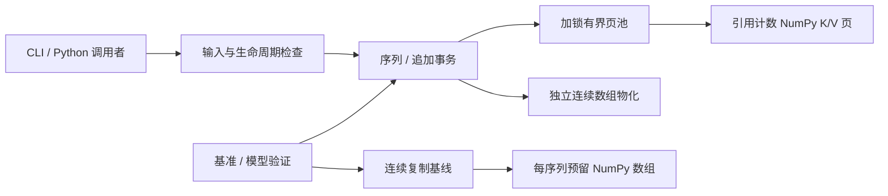

# 架构与 API

[English](../en/ARCHITECTURE.md) · [研究](RESEARCH.md) · [代码导读](WALKTHROUGH.md)

## 模块边界

| 文件 | 职责 |
|---|---|
| [core.py](../../src/branchsafe/core.py) | 配置、输入校验、页所有权、写入凭据、事务与不变量 |
| [baseline.py](../../src/branchsafe/baseline.py) | 相同合同与载荷预算的连续复制基线 |
| [cli.py](../../src/branchsafe/cli.py) | 离线示例；四数组 NPZ 输入与接受后缀输出 |
| [provenance.py](../../src/branchsafe/provenance.py) | 源码指纹及适合公开的环境证据 |
| [benchmark.py](../../benchmark.py) | 重复存储工作负载与机器可读测量记录 |
| [validate_model.py](../../scripts/validate_model.py) | 可选预训练模型适配验证 |
| [analyze.py](../../scripts/analyze.py) | 从原始结果生成表格与图表 |

核心依赖 NumPy，不依赖模型运行时。它存储调用者提供的张量，不计算 query、attention、logits，也不决定草稿接受率。调用者负责模型身份、位置、attention mask，以及缓存前缀是否真正属于当前请求。

## 配置与所有权

`CacheConfig(layers, heads, head_dim, page_size=16, max_pages=4096, dtype="float32", max_sequences=4096)` 要求维度和限制为正整数，拒绝布尔值。dtype 仅支持 `float16`、`float32`、`float64`，输入必须精确匹配配置。K 和 V 须为相同形状、全部数值有限的 NumPy 数组 `[layers,tokens,heads,head_dim]`。允许非连续数组，存储时复制；零 token 写入是合法空操作。

`PagedCache(config, sharing=True)` 创建按需分配的载荷池。`sharing=False` 使用相同页管理器，但分叉时复制可见前缀。`DenseCache(config, max_tokens)` 为每个活动序列预留一对连续 K/V 缓冲区；追加只复制新增 token，不拼接完整前缀。连续基线同样受 `max_pages * page_bytes` 总预算约束。

只能通过 `cache.create()` 或 `sequence.fork()` 创建序列。池拥有序列生命周期；应显式关闭资源或使用缓存上下文。物化数组是独立副本，调用者可安全修改。私有属性属于实现细节；Python 不能为恶意反射访问提供安全隔离。

## 公开操作

| 操作 | 返回 / 效果 | 重要失败条件 |
|---|---|---|
| `cache.create()` | 空的受管理序列 | 载荷或序列预算不足 |
| `sequence.length` | 可见 token 数 | 序列或缓存已关闭 |
| `sequence.append(k,v,ticket=None)` | 复制新增 KV | 非法输入、过期/外来凭据、容量不足 |
| `sequence.fork()` | 独立逻辑分支 | 无法容纳新序列或完整副本 |
| `sequence.truncate(n)` | 保留前 `n` 个 token | `n` 不在 `[0,length]` 或非整数 |
| `sequence.materialize()` | 独立连续 `(k,v)` 数组 | 已关闭；宿主机分配也可能失败 |
| `sequence.ticket()` | 不可变 `WriteTicket(sequence_id,epoch,length)` | 序列或缓存已关闭 |
| `sequence.transaction()` | 立即分叉的隔离追加事务 | 分叉准入失败 |
| `tx.append(k,v)` | 只向事务子序列追加 | 相同输入与容量检查 |
| `tx.commit(accepted_tokens=None)` | 父序列采用已接受新前缀 | 父序列变化/关闭、数量非法、事务结束 |
| `tx.rollback()` / `tx.close()` | 丢弃子序列；幂等 | 重复清理不报错 |
| `sequence.close()` / `cache.close()` | 释放所有权；幂等 | 后续读取/写入报错 |
| `cache.stats()` | 容量与复制计数 | 关闭后仍可读取计数 |
| `cache.check_invariants()` | 断言内部一致性 | 实现错误会触发断言 |

`accepted_tokens` 指**自事务创建以来追加的新 token 数**，不是总长度。`None` 接受全部新增 token，`0` 一个也不接受。即使接受零个 token，成功提交也会使旧凭据失效。非法接受数量可以在退出上下文前修正。未提交的上下文退出（包括应用异常）会回滚；事务结束后不得重新进入、追加或提交。不使用 `with` 时，调用者必须显式关闭事务。

## 失败与并发合同

- `ValueError`：形状、dtype、数值、长度或接受数量非法；`TypeError`：API 对象或凭据类型非法。
- `CapacityError`：载荷或序列预算拒绝准入；`StaleWriteError`：乐观写入/提交发现所有者或版本变化；`ClosedError`：资源生命周期已结束。三者均继承 `CacheError`。
- 池级 `RLock` 覆盖校验与发布。并发操作串行执行；同一凭据最多授权一次成功的非空追加。这是正确性设计，不代表并行吞吐优势。
- 容量拒绝发生在分配/发布之前。可恢复分配与复制失败测试检查可见数据不变、无活动所有权泄漏。失败操作可能改变保留空闲页或历史峰值；元数据发布时任意解释器分配失败、异步中断不属于原子性保证。
- 追加期间调用者不得并发修改输入。不返回可写存储视图；不支持跨进程或异步设备执行。

## 资源计量

`live_bytes` 与 `peak_bytes` 统计受管理数组容量；`allocated_bytes` 还包含页池保留复用的空闲页。`close()` 释放保留数组。但 Python 分配器可能继续保留进程内存，释放载荷不等于 RSS 必然下降。

`copied_bytes` 统计成功的追加载荷、完整前缀复制和有效 COW 尾部复制，不含输入验证读取、页表元数据和 `materialize()` 输出复制。基准单独测量含物化的工作流，避免忽略消费者成本。连续基线的 `live_pages`/`peak_pages` 是向上折算的等效页容量，不是物理页数。

活动序列数有上限；页表元数据仍独立于载荷计量。输入、模型权重、连续输出、NumPy/Python 开销及进程 RSS 均不包含在池预算中。CLI 另将 NPZ 解压载荷限制为 256 MiB、配置池载荷限制为 2 GiB，禁止 pickle 数组，并拒绝相同输入输出路径。

## 明确取舍

完整复制页式方案将共享收益与页管理开销分离。连续基线更适合连续读取与短分支。返回连续副本让所有权合同简单，但逐步 attention 若每次都要求物化，可能抵消 COW 收益。直接消费页式数据的后端必须另行实现并验证数值与性能，本项目不暗示已经具备该后端。
